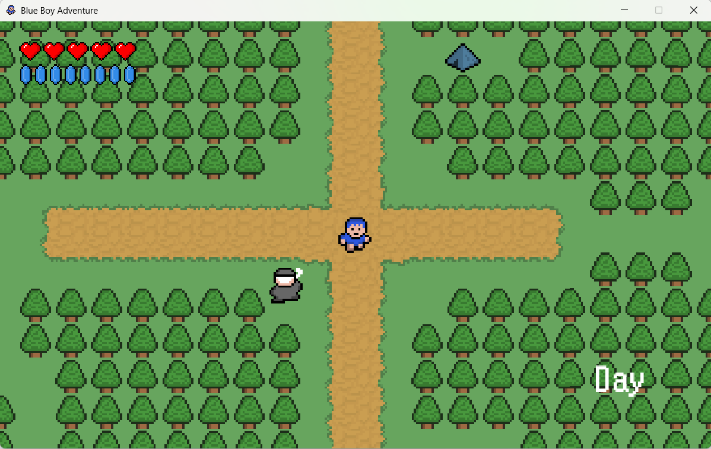
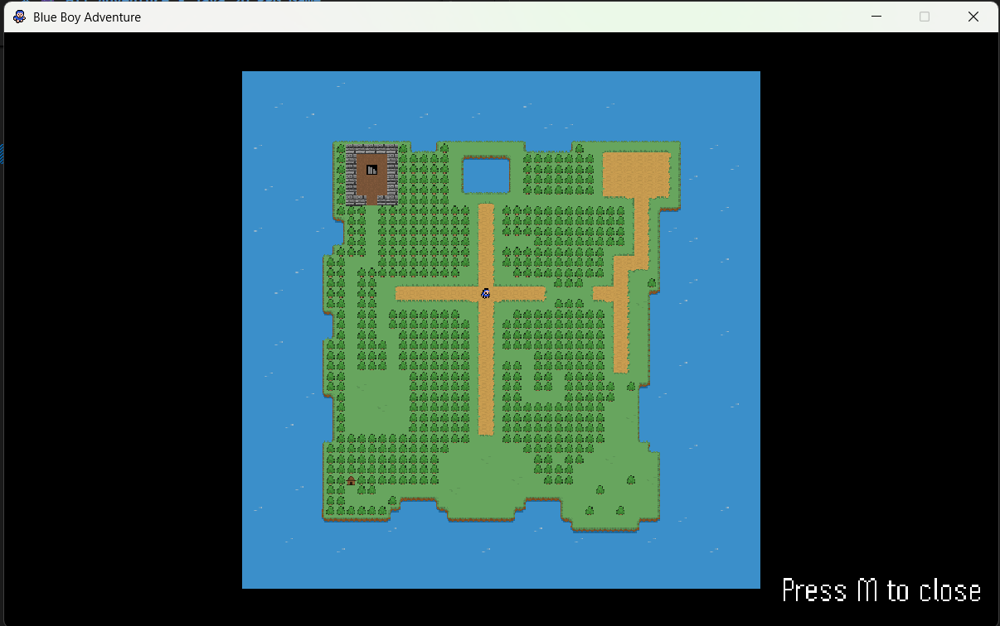

# 🎮 Blue Boy Adventure - Java 2D RPG Game

[](https://www.oracle.com/java/)
[](LICENSE)
[]()
[]()

A classic 2D top-down action RPG game inspired by retro classics like The Legend of Zelda, built from scratch using Java Swing.


---

## 📋 Table of Contents

- [Overview](#-overview)
- [Features](#-features)
- [Screenshots](#-screenshots)
- [Getting Started](#-getting-started)
  - [Prerequisites](#prerequisites)
  - [Installation](#installation)
  - [Running the Game](#running-the-game)
- [How to Play](#-how-to-play)
- [Game Controls](#-game-controls)
- [Project Structure](#-project-structure)
- [Development](#-development)
  - [Building from Source](#building-from-source)
  - [Running Tests](#running-tests)
- [Roadmap](#-roadmap)
- [Contributing](#-contributing)
- [Credits](#-credits)
- [License](#-license)
- [Contact](#-contact)

---

## 🌟 Overview

**HIT Adventure** is a 2D action RPG game where you embark on a quest to explore a mysterious island, defeat monsters, collect treasures, and interact with NPCs. Built entirely in Java using Swing for graphics and following OOP principles.

### 🎯 Project Goals

- Learn game development fundamentals
- Practice Object-Oriented Programming in Java
- Implement classic game mechanics (collision, animation, AI)
- Build a complete game from scratch

### 🎨 Game Style

- **Art Style:** 16-bit pixel art (retro aesthetic)
- **Perspective:** Top-down 2D
- **Genre:** Action RPG / Adventure
- **Resolution:** 768x576 pixels (16:12 ratio)
- **Frame Rate:** 60 FPS

---

## ✨ Features

### 🎮 Core Gameplay

- [x] **Player System**

  - Smooth 4-directional movement (WASD / Arrow keys)
  - Walking animation (8 sprites: 4 directions × 2 frames)
  - Character stats (HP, Level, Attack, Defense, EXP)
  - Inventory system (20 item slots)

- [x] **World & Exploration**

  - Large scrolling tile-based map (50×50 tiles = 2400×2400 pixels)
  - Multiple terrain types (grass, water, trees, walls, sand)
  - Camera system that follows the player
  - Smooth viewport rendering

- [x] **Collision System**

  - Precise tile collision detection
  - Object collision (keys, doors, chests)
  - NPC and monster collision
  - Map boundary detection
  - Smooth corner sliding

- [ ] **Interactive Objects** _(In Progress)_

  - 🔑 Keys - Unlock doors and chests
  - 🚪 Doors - Block pathways
  - 📦 Chests - Contain treasures
  - 👢 Boots - Increase movement speed
  - ❤️ Hearts - Restore HP

- [ ] **NPCs & Dialogue** _(Planned)_

  - Multiple NPC characters
  - Branching dialogue system
  - Quest givers
  - Merchants for trading

- [ ] **Combat System** _(Planned)_

  - Attack mechanics (Space key)
  - Monster AI with pathfinding
  - Damage calculation (Attack - Defense)
  - Experience and leveling system
  - Death and respawn mechanics

- [ ] **UI & HUD** _(Planned)_

  - HP display with heart icons
  - Inventory interface
  - Message log system
  - Pause menu
  - Title screen

- [ ] **Audio** _(Planned)_

  - Background music
  - Sound effects (attack, pickup, damage)
  - Volume controls

- [ ] **Save System** _(Planned)_
  - Save game progress
  - Load saved games
  - Config file for settings

---

## 📸 Screenshots

### Game Window


_Main game window showing tile-based world_

### Tile Rendering


_50×50 tile world with various terrain types_

### Player Movement


_Smooth player animation and movement_

### Collision Detection


_Debug view showing collision hitboxes_

---

## 🚀 Getting Started

### Prerequisites

Before you begin, ensure you have the following installed:

- **Java JDK 8 or higher**

  - Check version: `java -version`
  - Download: [Oracle JDK](https://www.oracle.com/java/technologies/downloads/) or [OpenJDK](https://openjdk.org/)

- **IDE (Optional but recommended)**

  - [Eclipse IDE for Java Developers](https://www.eclipse.org/downloads/)
  - [IntelliJ IDEA Community Edition](https://www.jetbrains.com/idea/download/)
  - [Visual Studio Code](https://code.visualstudio.com/) with Java extensions

- **Git** (for cloning the repository)
  - Download: [Git](https://git-scm.com/downloads)

### Installation

1. **Clone the repository**

```bash
git clonehttps://github.com/Conmeosoma/JAVA_GAME
cd JAVA_GAME
```

2. **Open in your IDE**

**For Eclipse:**

- File → Open Projects from File System
- Select the project folder
- Click Finish

**For ApacheNetBean:**

- File → Open Projects from File System
- Select the project folder
- Click RUN PROJECT

**For IntelliJ IDEA:**

- File → Open
- Select the project folder
- Click OK

**For VS Code:**

- File → Open Folder
- Select the project folder

3. **Verify project structure**

```
blue-boy-adventure/
├── src/
│   ├── main/
│   │   └── Main.java
│   ├── entity/
│   │   ├── Entity.java
│   │   └── Player.java
│   ├── tile/
│   │   ├── Tile.java
│   │   └── TileManager.java
│   └── ...
├── res/
│   ├── player/
│   ├── tiles/
│   ├── maps/
│   └── sound/
├── docs/
├── README.md
└── .gitignore
```

### Running the Game

**Method 1: Run from IDE**

1. Navigate to `src/main/Main.java`
2. Right-click → Run As → Java Application
3. Game window should appear

**Method 2: Run from Command Line**

```bash
# Compile
javac -d bin -sourcepath src src/main/Main.java

# Run
java -cp bin main.Main
```


---

## 🎯 How to Play

### Story

You are a young adventurer who arrives on a mysterious island seeking legendary treasure. To find it, you must:

1. Explore the island and talk to NPCs for hints
2. Collect three keys hidden across the land
3. Defeat monsters and gain experience
4. Open the treasure chest and claim your reward!

### Objectives

- 🗺️ **Explore** the world and discover new areas
- 🔑 **Find Keys** to unlock doors and chests
- 💬 **Talk to NPCs** to learn about quests and secrets
- ⚔️ **Fight Monsters** to level up and grow stronger
- 🏆 **Find the Treasure** and complete your adventure!

### Tips

- 💡 Talk to the Old Man near the starting point for hints
- 💡 Water blocks your path - find another way around
- 💡 Green Slimes are weak enemies, good for gaining your first levels
- 💡 Save often! The game can be tough
- 💡 Collect hearts to restore your HP

---

## 🕹️ Game Controls

### Keyboard Controls

| Action         | Key(s)       | Description                              |
| -------------- | ------------ | ---------------------------------------- |
| **Move Up**    | `W` or `↑`   | Move player upward                       |
| **Move Down**  | `S` or `↓`   | Move player downward                     |
| **Move Left**  | `A` or `←`   | Move player left                         |
| **Move Right** | `D` or `→`   | Move player right                        |
| **Attack**     | `SPACE`      | Swing your weapon                        |
| **Interact**   | `ENTER`      | Talk to NPCs / Open chests / Use objects |
| **Pause**      | `ESC` or `P` | Pause the game                           |
| **Inventory**  | `I`          | Open inventory (planned)                 |

### Control Tips

- Hold movement keys for continuous movement
- You can only move in one direction at a time (4-directional movement)
- Attack has a cooldown - don't spam!
- Press ENTER when standing near an NPC to start dialogue

---

## 📁 Project Structure

```
JAVA_GAME/
│
├── src/                          # Source code
│   ├── main/                     # Main application
│   │   └── Main.java            # Entry point
│   │
│   ├── entity/                   # Game entities
│   │   ├── Entity.java          # Base entity class
│   │   ├── Player.java          # Player character
│   │   ├── NPC_OldMan.java      # NPC: Old Man
│   │   └── MON_GreenSlime.java  # Monster: Green Slime
│   │
│   ├── tile/                     # Tile system
│   │   ├── Tile.java            # Tile class
│   │   └── TileManager.java     # Tile rendering & management
│   │
│   ├── object/                   # Interactive objects
│   │   ├── SuperObject.java     # Base object class
│   │   ├── OBJ_Key.java         # Key object
│   │   ├── OBJ_Door.java        # Door object
│   │   └── OBJ_Chest.java       # Chest object
│   │
│   ├── ui/                       # User interface
│   │   └── UI.java              # HUD, menus, dialogue
│   │
│   ├── sound/                    # Sound system
│   │   └── Sound.java           # Audio player
│   │
│   └── util/                     # Utilities
│       ├── KeyHandler.java      # Keyboard input handler
│       ├── CollisionChecker.java # Collision detection
│       └── AssetSetter.java     # Place objects/NPCs on map
│
├── res/                          # Resources (assets)
│   ├── player/                   # Player sprites
│   │   ├── boy_up_1.png
│   │   ├── boy_up_2.png
│   │   ├── boy_down_1.png
│   │   └── ...
│   │
│   ├── tiles/                    # Tile images
│   │   ├── 000.png              # Grass
│   │   ├── 001.png              # Wall
│   │   ├── 002.png              # Water
│   │   └── ...
│   │
│   ├── objects/                  # Object sprites
│   │   ├── key.png
│   │   ├── door.png
│   │   └── ...
│   │
│   ├── npc/                      # NPC sprites
│   │   ├── oldman_down_1.png
│   │   └── ...
│   │
│   ├── monster/                  # Monster sprites
│   │   ├── greenslime_down_1.png
│   │   └── ...
│   │
│   ├── maps/                     # Map data files
│   │   ├── world01.txt          # Main world map
│   │   └── ...
│   │
│   └── sound/                    # Audio files
│       ├── BlueBoyAdventure.wav # BGM
│       ├── coin.wav
│       └── ...
│
├── docs/                         # Documentation
│   ├── images/                   # Screenshots
│   ├── ARCHITECTURE.md          # Code architecture
│   └── CONTROLS.md              # Detailed controls
│
├── lib/                          # External libraries (if any)
│
├── bin/                          # Compiled .class files
│
├── .gitignore                    # Git ignore file
├── README.md                     # This file
├── LICENSE                       # License file
└── pom.xml                       # Maven config (optional)
```

---

## 🔧 Development

### Building from Source

**Using Command Line:**

```bash
# Navigate to project root
cd JAVA_GAME

# Compile all Java files
javac -d bin -sourcepath src src/main/Main.java src/**/*.java

# Run the game
java -cp bin main.Main
```

**Create JAR file:**

```bash
# Create manifest file
echo "Main-Class: main.Main" > manifest.txt

# Create JAR
jar cfm JAVA_GAME.jar manifest.txt -C bin . -C res .

# Run JAR
java -jar JAVA_GAME.jar
```

**Using Maven (if configured):**

```bash
# Compile
mvn compile

# Run
mvn exec:java

# Package
mvn package
```

### Running Tests

Currently, this project uses manual testing. Future plans include:

```bash
# Unit tests (planned)
mvn test

# Integration tests (planned)
mvn verify
```

**Manual Testing Checklist:**

- [ ] Player movement in all 4 directions
- [ ] Collision with walls, water, trees
- [ ] Camera follows player correctly
- [ ] FPS stays at 60
- [ ] No crashes when picking up items
- [ ] Dialogue displays correctly
- [ ] Combat deals damage properly
- [ ] Save/Load works

### Debug Mode

Enable debug mode by pressing `F3` (planned) to see:

- FPS counter
- Player world position (X, Y)
- Collision hitboxes
- Tile coordinates
- Memory usage

---

## 🗺️ Roadmap

### ✅ Phase 1: Foundation (Week 1) - COMPLETED

- [x] Project setup
- [x] Game window and panel
- [x] Game loop (60 FPS)
- [x] Tile system
- [x] Map loading and rendering
- [x] Camera/viewport system
- [x] Keyboard input handler

### 🔄 Phase 2: Character & Movement (Week 2) - IN PROGRESS

- [x] Entity base class
- [x] Player class with stats
- [x] Player movement
- [x] Walk animation
- [x] Collision detection system
- [ ] Testing and polish

### 📅 Phase 3: Objects & Interactions (Week 3) - PLANNED

- [ ] Object system (keys, doors, chests)
- [ ] Object placement
- [ ] Inventory system
- [ ] Item collection
- [ ] NPC system
- [ ] Dialogue system

### 📅 Phase 4: Combat & Polish (Week 4) - PLANNED

- [ ] Monster/enemy system
- [ ] Combat mechanics
- [ ] HP system
- [ ] Experience and leveling
- [ ] UI/HUD design
- [ ] Sound effects and music
- [ ] Save/Load system
- [ ] Bug fixes and optimization

### 🚀 Phase 5: Extensions (Future)

- [ ] Multiple dungeons/maps
- [ ] Boss battles
- [ ] Equipment system
- [ ] Quest system
- [ ] Achievements
- [ ] Localization (multiple languages)

---

## 🤝 Contributing

Contributions are welcome! This is a learning project, so feel free to:

- 🐛 Report bugs
- 💡 Suggest features
- 📝 Improve documentation
- 🎨 Create artwork/sprites
- 🔧 Submit pull requests

### How to Contribute

1. Fork the repository
2. Create your feature branch (`git checkout -b feature/AmazingFeature`)
3. Commit your changes (`git commit -m 'Add some AmazingFeature'`)
4. Push to the branch (`git push origin feature/AmazingFeature`)
5. Open a Pull Request

### Code Style

- Follow Java naming conventions (camelCase for variables/methods, PascalCase for classes)
- Add JavaDoc comments for public methods
- Keep methods under 50 lines when possible
- Write meaningful commit messages

### Reporting Issues

When reporting issues, please include:

- Your operating system
- Java version (`java -version`)
- Steps to reproduce
- Expected vs actual behavior
- Screenshots (if applicable)

---

## 🎨 Credits

### Development Team

- **Lead Developer:** Nguyen Nam Tien
- **Graphics Developer:** Hoang Thanh Dieu

### Inspiration & Resources

- **Tutorial Series:** [RyiSnow YouTube Channel](https://www.youtube.com/c/RyiSnow)
- **Game Inspiration:** The Legend of Zelda (Nintendo)

### Assets & Resources

**Sprites:**

- Player sprites: [Source / "Created by team"]
- Tile graphics: [OpenGameArt.org]
- Monster sprites: [Kenney.nl]

**Sound Effects:**

- Background music: [Incompetech.com]
- SFX: [Freesound.org]

**Fonts:**

- Game font: [Font name and source]

**Tools:**

- **IDE:** Eclipse / IntelliJ IDEA
- **Graphics:** Aseprite, Paint.NET
- **Map Editor:** Tiled Map Editor
- **Version Control:** Git & GitHub

### Special Thanks

- RyiSnow for the comprehensive game development tutorials
- OpenGameArt community for free game assets
- Java gaming community for support and resources

---

## 📄 License

This project is licensed under the MIT License - see the [LICENSE](LICENSE) file for details.

```
MIT License

Copyright (c) 2026 [Your Name]

Permission is hereby granted, free of charge, to any person obtaining a copy
of this software and associated documentation files (the "Software"), to deal
in the Software without restriction, including without limitation the rights
to use, copy, modify, merge, publish, distribute, sublicense, and/or sell
copies of the Software, and to permit persons to whom the Software is
furnished to do so, subject to the following conditions:

The above copyright notice and this permission notice shall be included in all
copies or substantial portions of the Software.

THE SOFTWARE IS PROVIDED "AS IS", WITHOUT WARRANTY OF ANY KIND, EXPRESS OR
IMPLIED, INCLUDING BUT NOT LIMITED TO THE WARRANTIES OF MERCHANTABILITY,
FITNESS FOR A PARTICULAR PURPOSE AND NONINFRINGEMENT. IN NO EVENT SHALL THE
AUTHORS OR COPYRIGHT HOLDERS BE LIABLE FOR ANY CLAIM, DAMAGES OR OTHER
LIABILITY, WHETHER IN AN ACTION OF CONTRACT, TORT OR OTHERWISE, ARISING FROM,
OUT OF OR IN CONNECTION WITH THE SOFTWARE OR THE USE OR OTHER DEALINGS IN THE
SOFTWARE.
```

---

## 📞 Contact

**Project Repository:** [https://github.com/yourusername/blue-boy-adventure](https://github.com/yourusername/blue-boy-adventure)

**Issues & Bugs:** [https://github.com/yourusername/blue-boy-adventure/issues](https://github.com/yourusername/blue-boy-adventure/issues)

**Email:** your.email@example.com

**Discord Server:** [Join our community](https://discord.gg/yourinvite) (optional)

---

## 📚 Additional Documentation

- [Architecture Documentation](docs/ARCHITECTURE.md) - Code structure and design patterns
- [Controls Guide](docs/CONTROLS.md) - Detailed control scheme
- [Map Creation Guide](docs/MAP_CREATION.md) - How to create custom maps
- [Sprite Guide](docs/SPRITES.md) - Sprite specifications and guidelines
- [Sound Integration](docs/SOUND.md) - Audio system documentation

---

## 🎮 Enjoy the Game!

Thank you for checking out Blue Boy Adventure! If you enjoy the game, please:

⭐ **Star this repository**  
🐛 **Report any bugs**  
💬 **Share your feedback**  
🎨 **Contribute your ideas**

Happy adventuring! 🗡️🛡️

---

_Last Updated: January 2026_  
_Version: 0.2.0 (In Development)_
